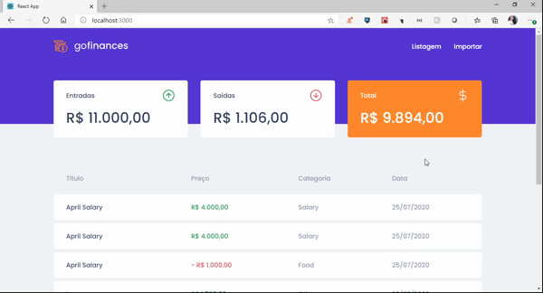

<h1 align="center">
 
  
 
 
Be The Hero
</h1>

Aplicativo que permite a visualização de transações e importação de novas transações através de um arquivo CSV. 

  

## Tecnologias Utilizadas
[//]: # (Add the features of your project here:)
Essa aplicação utiliza ferramentas e práticas atualizadas na criação de aplicações web e mobile.

- ⚛️ **React Js** — Uma biblioteca javascript para a construção de interfaces.
- ⚛️ **React Native** — Uma biblioteca que viabiliza a criação de aplicativos nativos para Android e IOS.

## Iniciando o Projeto
1. Clonar o repositório utilizando o comando git clone https://github.com/RosaAmanda/GoFinances.git
2. Navegar para a pasta GoFinances

## Iniciando o Back-End
1. Navegar para a pasta backend: cd backend
2. Executar npm install para instalar as dependências
3. Executar npm start para iniciar a aplicação backend

## Iniciando o Front-End
1. Navegar para a pasta frontend: cd frontend
2. Executar yarn para instalar as dependências
3. Executar yarn start para iniciar a aplicação frontend
